# File conventions

Each title of local gazetteers corresponds to a catalog record from the Harvard-Yenching Library's [Chinese Rare Local Gazetteers collection](https://hollis.harvard.edu/primo-explore/search?query=any,contains,Harvard-Yenching%20Library%20Chinese%20Local%20Gazetteers%20Project%22&tab=everything&search_scope=everything&vid=HVD2&lang=en_US&offset=0&fromRedirectFilter=true). We will provide a spreadsheet of all the titles to be typed in this project, containing the following three column of information:

* HOLLIS number: this is the unique record identifier used by Harvard-Yenching Library.
* Title
* URL: this points to Harvard-Yenching Library's online catalog, where the **View Online** link on the page opens the image viewer for typing.

Save the text in plain text format (`.txt`) with Unicode `utf-8` encoding. Each Chinese local gazetteer title is saved in its own `.txt` file. Name the file with the HOLLIS number provided in the spreadsheet (e.g., `07453713.txt`). Create a `.zip` archive of all files.

Make use of the complete character repertoire found in Unicode version 5.1. This includes characters in the following Unicode blocks when applicable:

* CJK Unified Ideographs [Extension A](https://en.wikipedia.org/wiki/CJK_Unified_Ideographs_Extension_A) (U+3400 -- U+4DFF)
* CJK Unified Ideographs [Extension B](https://en.wikipedia.org/wiki/CJK_Unified_Ideographs_Extension_B) (U+20000 -- U+2A6DF)

At this point, do not make use of the characters in Extensions C, D, or E.

We will also need the list of unknown characters and symbols (see "unknown characters" below). Please send the list in two versions, both in the original file format of your choice (e.g. RTF, DOC, XLS) and as PDF.

Every file should begin with `<book>` and end with `</book>`. Include HOLLIS number and title between the `<meta>` and `</meta>` tags, using information provided in the spreadsheet. All content transcription and other tags should be placed between the `<content>` tags.

The file structure should look as follows:
```
<book>
  <meta>
    <hollis>HOLLIS NUMBER</hollis>
    <title>TITLE</title>
  </meta>
  <content>
    <page seq="1">...</page>
    ...
    <page seq="xxx">...</page>
  </content>
</book>
```

# Contents

Type all contents of each gazetteer between the `<content>` and `</content>` tags.

Harvard-Yenching Library defines each individual scan as a "sequence" and all scans for a gazetteer title are numbered sequentially across volumes; e.g., [here](http://id.lib.harvard.edu/alma/990074670640203941/catalog) is the catalog entry for 江寧府志 and its "View Online" link opens up the corresponding [viewer](http://nrs.harvard.edu/urn-3:FHCL:14071862), where every scan's sequence number is clearly indicated. Begin typing the content of every sequence with `<page seq="SEQUENCE NO.">` and end with `</page>`, and always type in the corresponding sequence number in the opening `<page>` tag. Ignore volume numbers (if any). Do not type any repetitive marginalia (e.g., book title and pagination). Except the book cover, all sequences have two halves that correspond to natural breaks from the book spine. When typing, always use `<pb />` to indicate such natural breaks. For example:

Image | Markup
----- | ------
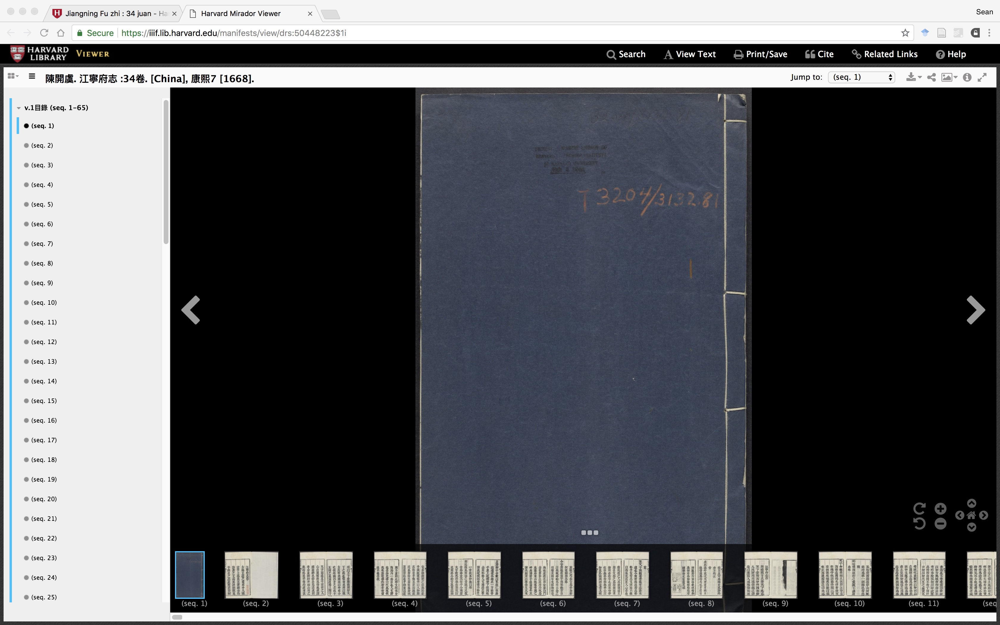 | `<page seq="1" />`<br /><br />**Note:** Treat book cover as a textless sequence.
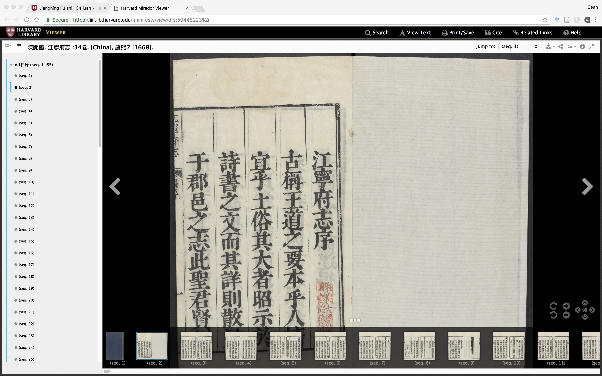 | `<page seq="2"><pb />TEXTS</page>`<br /><br />**Note:** For sequences immediately following a book cover sequence, there is often a blank half-sequence. Still denote the natural break from the book spine where it occurs and place the typed texts accordingly.
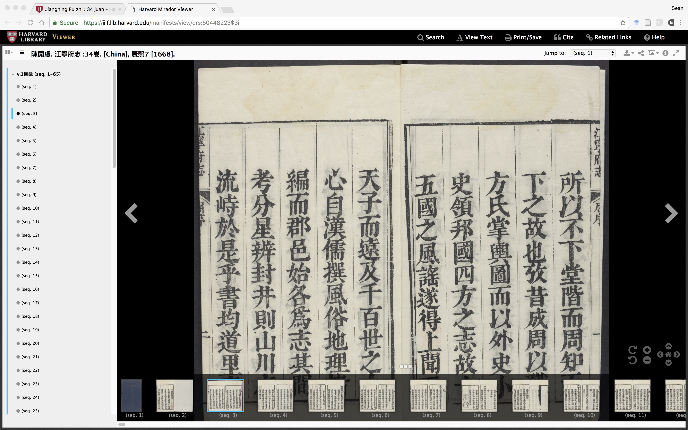 | `<page seq="3">TEXTS<pb />TEXTS</page>`
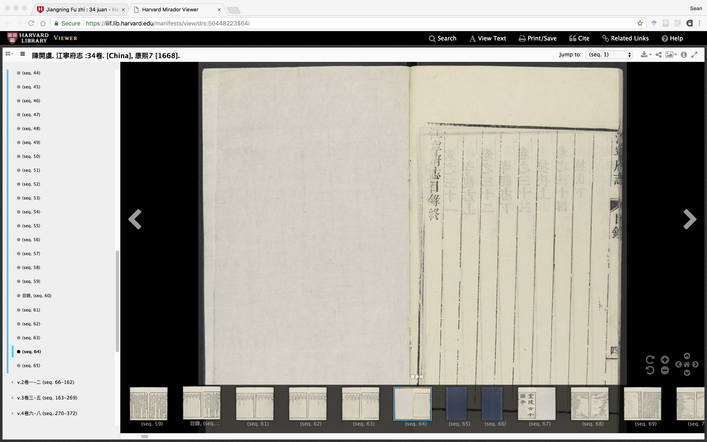 | `<page seq="64">TEXTS<pb /></page>`<br /><br />**Note:** For sequences at the end of a title/volume or immediately before a book cover sequence, there is often a blank half-sequence. Still denote the natural break from the book spine where it occurs and place the typed texts accordingly.

Ignore line changes in the text if the lines are part of the same paragraph. If a line change indicates a paragraph change, type a line break (i.e., hit the enter or return key once). For example:

Image | Markup
----- | ------
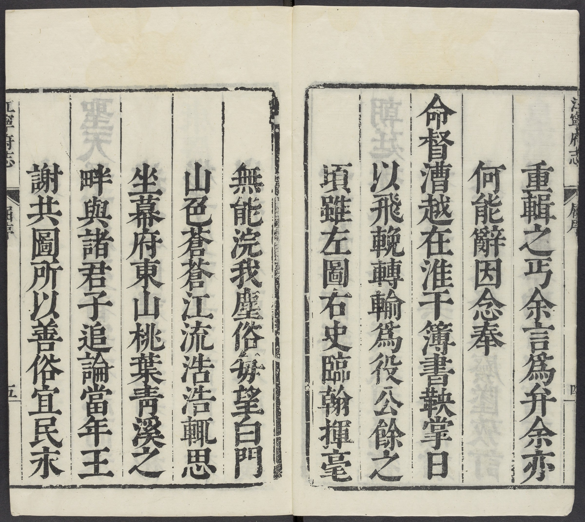 | `<page seq="x">重輯[...]念奉`<br /><br />`命督[...]揮毫<pb />TEXTS</page>`
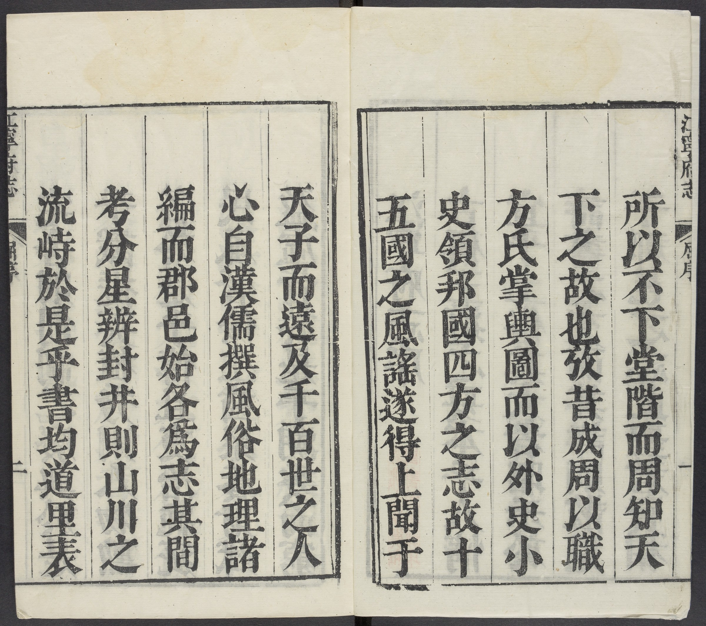 | `<page seq="x">TEXTS<pb />TEXTS</page>`<br /><br />**Note:** There are no paragraph changes, so ignore line changes and type the entire sequence in one line.
<!--  | `<page>務張之[...]以蘇辛未移疾[...]幽獨中</page>`<br /><br />**Note:** There are no in-line spaces or paragraph changes, so ignore line changes and type the entire page in one line.
 | `<page>大清[...]生 王三[...]人 割股[...]人 宋史思賢[...]人 <char no="001" />心療母母子俱全 王弟[...]</page>`<br /><br />**Note:** Use one single space to represent any in-line spaces (regardless of length) and paragraph changes. This text contains parallel lines and an unknown (i.e. untypable) character, and the markup code makes use of the corresponding protocols (see below). -->

## Font Sizes

Sometimes there are changes in font size (e.g., subscripts or small-fonts arranged in parallel). Use one single space to denote changes between font sizes, and continue typing the texts in the order of text flows. For example:

Image | Markup
----- | ------
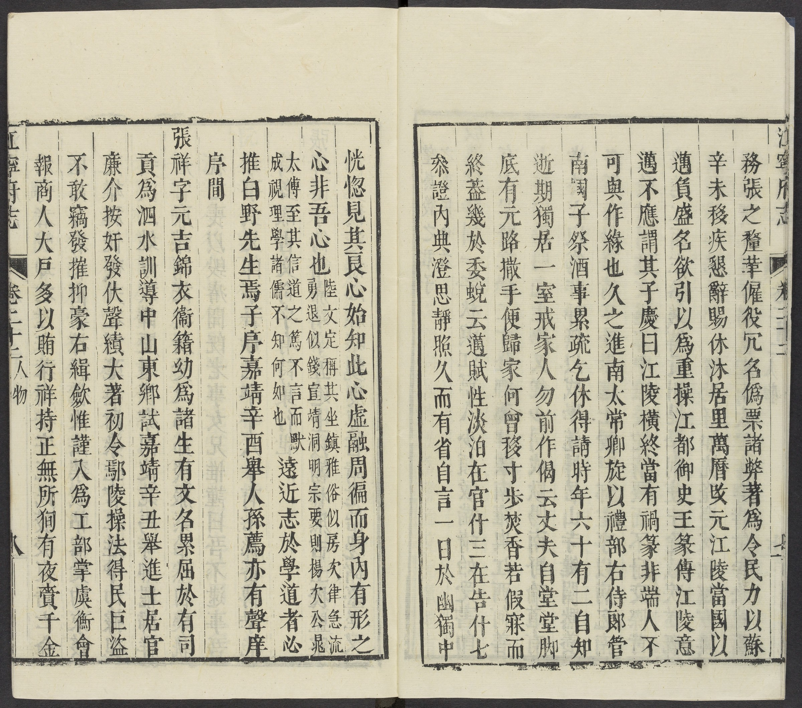 | `<page seq="x">TEXTS<pb />恍惚[...]心也 陸文[...]急流勇退[...]如也 遠近[...]序間`<br /><br />`張祥[...]</page>`
 | `<page seq="x">水注[...]即此 江總[...]西峰石壁[...]<pb />中一[...]</page>`

# Tables

Tables are defined by the presence of horizontal lines that divide up the sequence into table cells. If something looks like a table but there are no horizontal lines, it is most likely a list (see the *Lists* section below).

To indicate a table within the `<page>` tags, type `<tb>` at the beginning of it and `</tb>` at the end. In case that a table spans across the natural break from the book spine within a sequence, still type `<pb />` where it occurs between the `<tb>` and `</tb>` tags. If a table stretches over multiple sequences, treat its parts in different sequences as a new table, so that every pair of `<tb>` and `</tb>` exists wholly between a pair of `<page seq="x">` and `</page>`.

Within a table, type a pipe (i.e., `|`) to indicate the break between individual cells (i.e., every time you encounter a horizontal line, type a pipe). Unlike for regular texts in paragraphs, type a line break (i.e., hit the enter or return key once) to indicate every line change (see also the *Contents* section above).

For example, this sequence below:

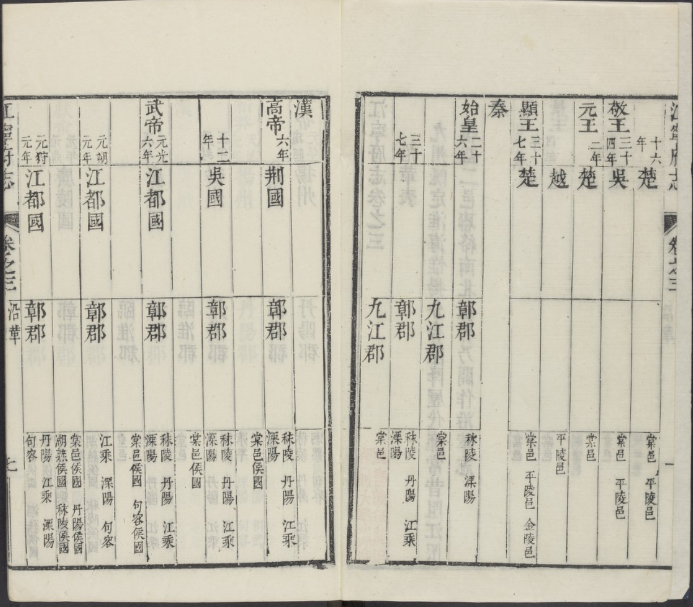

would be typed as such:

```
<page seq="x"><tb>十六年|楚||棠邑 平陵邑
敬王 三十四年|吳||棠邑 平陵邑
元王 二年|楚||棠邑
|越||平陵邑
顯王 三十七年|楚||棠邑 平陵邑 金陵邑
秦
始皇 二十六年||鄣郡|秣陵 溧陽
||九江郡|棠邑
三十七年||鄣郡|秣陵 丹陽 江乘 溧陽
||九江郡|棠邑
<pb />
漢|||
高帝 六年|荆國|鄣郡|秣陵 丹陽 江乘 溧陽
|||棠邑侯國
十二年|吳國|鄣郡|秣陵 丹陽 江乘 溧陽
|||棠邑侯國
武帝 元光六年|江都國|鄣郡|秣陵 丹陽 江乘 溧陽
|||棠邑侯國 句容侯國
元朔元年|江都國|鄣郡|江乘 溧陽 句容
|||棠邑侯國 丹陽侯國 湖熟侯國 秣陵侯國
元狩元年|江都國|鄣郡|丹陽 江乘 溧陽 句容</tb></page>
```

, where each line of markup code represents a vertical column in the sequence, and each pipe represents a horizontal line dividing table cells.

This example is instructive because it demonstrates several important principles for typing tables:

- A `<tb>` and `</tb>` pair would always exist wholly between a pair of `<page seq="x">` and `</page>` tags, but it can encompass a `<pb />` tag in between.
- A table is defined by the presence of horizontal lines, and each instance of those horizontal lines is clearly marked by a `|` (even when there are "empty cells").
  - While the vertical column that begins with `秦` does not have horizontal lines, it is still treated as part of a table based on intuition.
- Unlike for regular texts, line changes in tables *are* typed as line breaks.
- All other protocols from typing regular texts still apply (e.g., type a single space to indicate changes between font sizes).

Some gazetteers do not have vertical lines to separate every vertical column. In those cases, especially in tables, take extra care with typing parallel-line texts. For example, this sequence below:

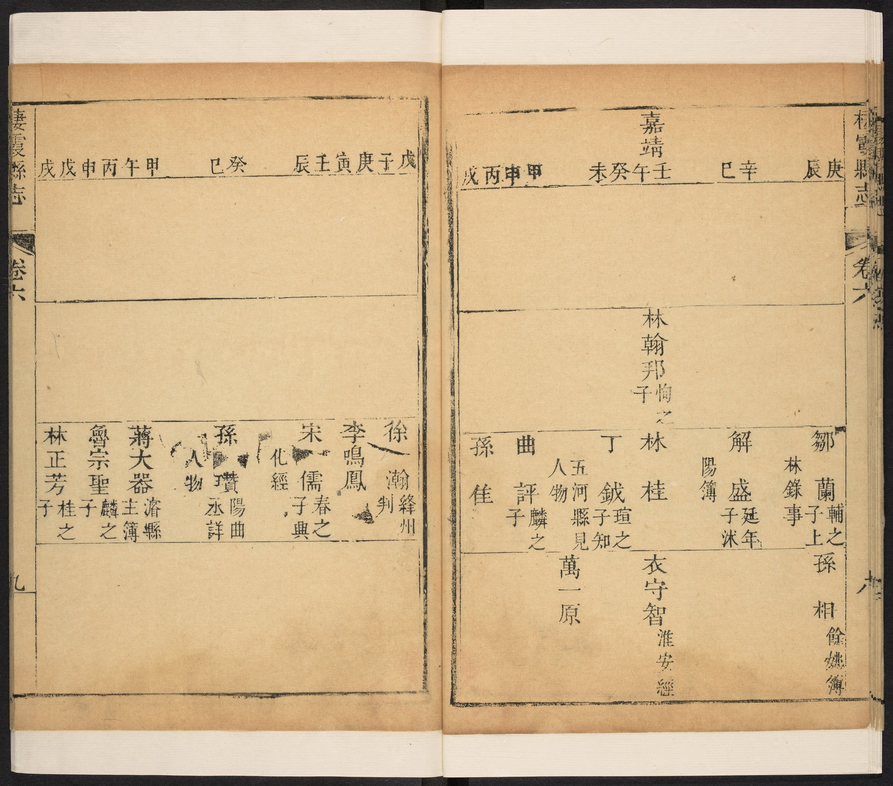

would be typed as such:

```
<page seq="x"><tb>庚辰|||鄒蘭 輔之子上|孫相 餘姚簿
|||林錄事|
辛巳|||解盛 延年子沐|
|||陽簿|
嘉靖 壬午||林翰邦 恂之子|林桂|衣守智 淮安經
癸未|||丁鉞 瑄之子知|
|||五河縣見人物|萬一原
甲申|||曲評 麟之子|
丙戌|||孫佳|
<pb />
[...]
</tb></page>
```

Besides parallel-line texts within the table, note that, as in typing regular texts, single space is only used to indicate change in font sizes or paragraphs. If you can identify a single space within a name etc. as a decorative space to make the table layout optically more pleasing, do not type it. There are multiple instances of decorative spaces in the sequence above; do not type them.

# Lists

Many lists look similar to tables in that they have multiple obvious breaks within a vertical column, but lists do not have horizontal lines (see *Tables* section above). Lists also have consistent and repetitive structure from one vertical column to the next.

To indicate a list within the `<page>` tags, type `<ls>` at the beginning of it and `</ls>` at the end. In case that a list spans across the natural break from the book spine within a sequence, still type `<pb />` where it occurs between the `<ls>` and `</ls>` tags. If a list stretches over multiple sequences, treat its parts in different sequences as a new list, so that every pair of `<ls>` and `</ls>` exists wholly between a pair of `<page seq="x">` and `</page>`.

Within a list, type a single space to indicate the break between individual list items. Unlike for regular texts in paragraphs, type a line break (i.e., hit the enter or return key once) to indicate every line change (see also the *Contents* section above).

**Note:** In general, the protocol for typing lists is very similar to the one for tables. The main difference is that for lists, one uses single space as separators rather than pipes.

For example, this sequence below:

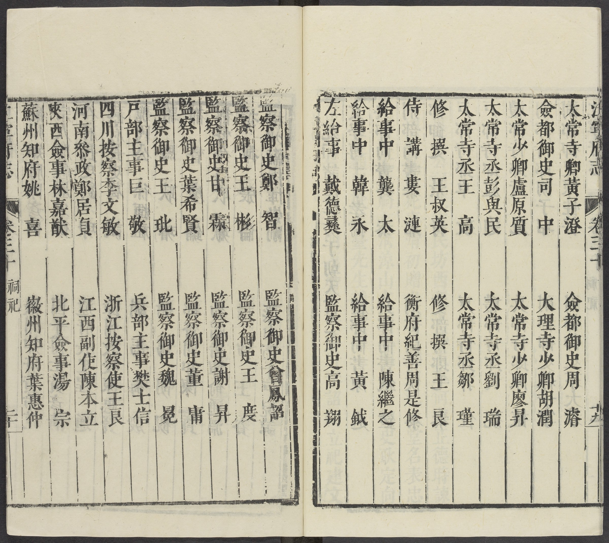

would be typed as such:

```
<page seq="x"><ls>太常寺卿黃子澄 僉都御史周濬
僉都御史司中 大理寺少卿胡潤
太常少卿盧原質 太常寺少卿廖昇
[...]
<pb />
[...]
</ls></page>
```
; and another like this sequence below:

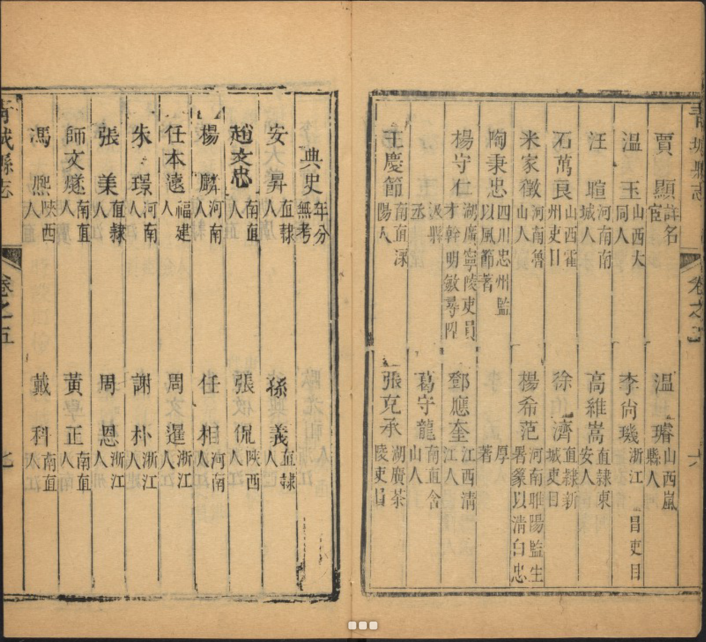

would be typed as such:

```
<page seq="x"><ls>賈顯 詳名宦 溫璿 山西嵐縣人
溫玉 山西大同人 李尚璣 浙江 昌吏目
[...]
<pb />
[...]
</ls></page>
```

In these examples, line changes are preserved when typing lists. Single space is used as separators and, as in typing regular texts, to denote change in font sizes. Note that both sequences have multiple instances of decorative spaces; do not type them.

## Table of Contents

Treat tables of contents as lists and follow the protocol for typing lists accordingly. For example, this sequence below:

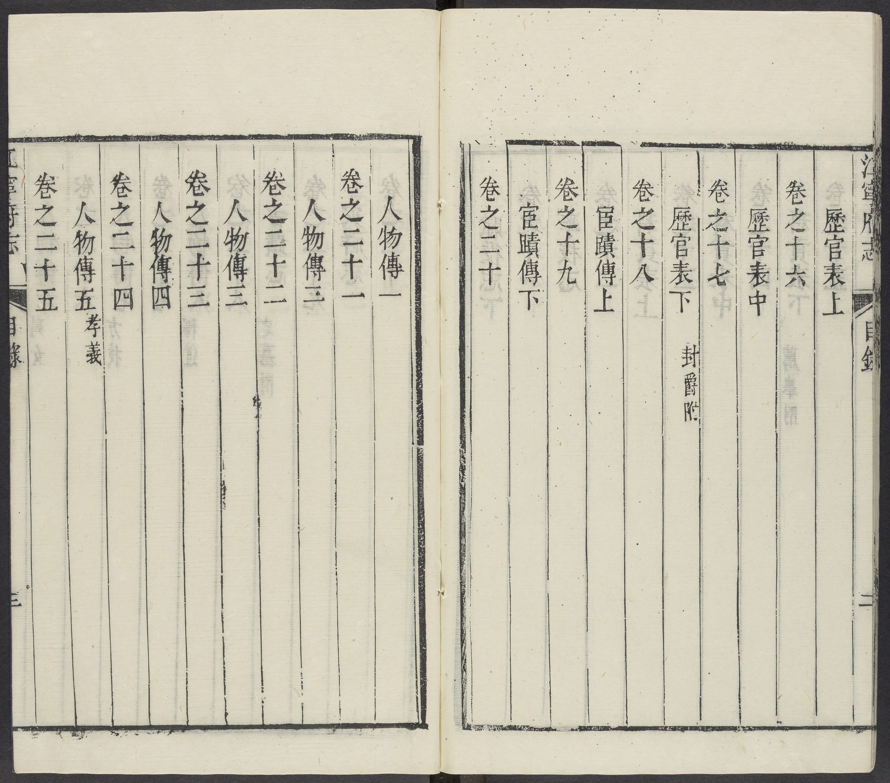

would be typed as such:

```
<page seq="x"><ls>歷官表上
卷之十六
歷官表中
卷之十七
歷官表下 封爵附
卷之十八
[...]
<pb />
[...]
</ls></page>
```

# Images

Type `` to mark the location of an image without any caption, title, or embedded texts.

If an image spans across the natural break from the book spine within a sequence, type `` where the image begins in the first half-sequence, `<pb />` where the natural break occurs, and `</img>` where the image ends in the second half-sequence. If an image stretches over multiple sequences, treat its parts in different sequences as a new image, so that every pair of `` and `</img>` exists wholly between a pair of `<page seq="x">` and `</page>`.

If an image has a caption, a title, or any other embedded texts, type the texts where they occur between the `` and `</img>` tags in one line. Follow all protocols for typing regular texts (e.g., use single space as separators).

<!-- * If there is a caption/title available, include it with a pair of nested `<caption>` tags, i.e.
```

  <caption>CAPTION</caption>
</img>
```
* If the image has texts embedded within, include the texts with a pair of nested `<text>` tags, i.e.
```

  <text>TEXTS</text>
</img>
```
* If the image has both a caption and texts embedded within, combine the two protocols above, i.e.
```

  <caption>CAPTION</caption>
  <text>TEXTS</text>
</img>
```
-->
For example:

Image | Markup
----- | ------
 | `<page seq="x">秦秣陵縣圖 青龍山 天印山 鍾山 秣陵縣<pb />覆舟山 聚寶山 雞籠山 越城 冶山 江乘縣 石頭 盧能山 大江 三山</img></page>`
 | `<page seq="x">四配陳設圖 菱 [...]</img><pb />東西哲陳設圖 栗 鹿脯 鹽 棗 燭 [...]</img></page>`<br /><br />**Note:** Be careful with identifying horizontal texts and typing them properly.
<!--  | `<page><caption>學宮<char no="002" /></caption><text>東 訓導 儒學 教諭宅 東廡 名宦祠</text></img></page>`<br /><br />**Note:** This image caption contains an unknown (i.e. untypable) character and the code makes use of the corresponding protocol (see below).
 | `<page><caption>南朝都建康圖</caption><text>建興郡 句容縣 [continue typing all texts]</text></img></page>`<br /><br />`<page><text>親康宮 <unr /><unr /> [continue typing all texts]</text></img></page>`<br /><br />**Note:** Although this map spans two pages, its caption (in its entirety) appears only on the first page. Thus, treat the first page as an image with both caption and texts embedded within, and the second page as an image with only texts embedded within. Also, the second page contains unreadable characters and the code makes use of the corresponding protocol (see below).
 | `<page></page>`<br /><br />`<page><caption>天印山</caption><text>在城南四十里高[continue typing all texts without line changes]</text></img></page>`<br /><br />**Note:** Same as above, except that the caption is on the second page.
 | `<page><caption>城圖-1</caption><text>東 太山行宮 [continue typing all texts]</text></img></page>`<br /><br />`<page><caption>城圖-2</caption><text>大士閣 <unr />洞 北 [continue typing all texts]</text></img></page>`<br /><br />**Note:** This map spans two pages and its caption (*城圖*) also spans the two pages. In this case, type the entire caption between every page's `<caption>` tags and add *-[number of page]* to the caption, i.e. `<caption>城圖-1</caption>`.
 | `<page><caption>星野圖</caption><text>東 危 北 南 虛 西</text></img></page>`<br /><br />**Note:** This image's caption is embedded within. -->

The following is a more complicated scenario, featuring an image that spans two sequences, mixed with regular texts and lists:

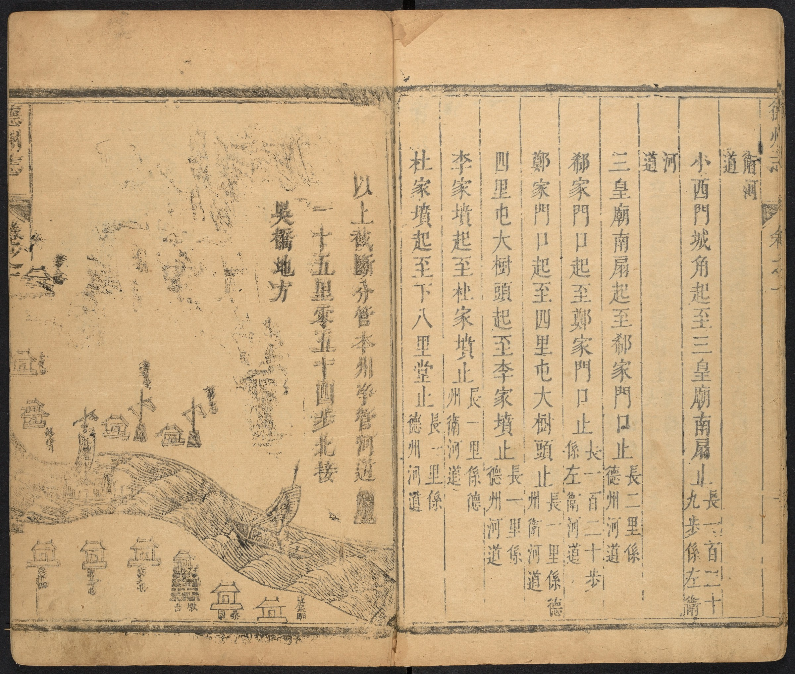

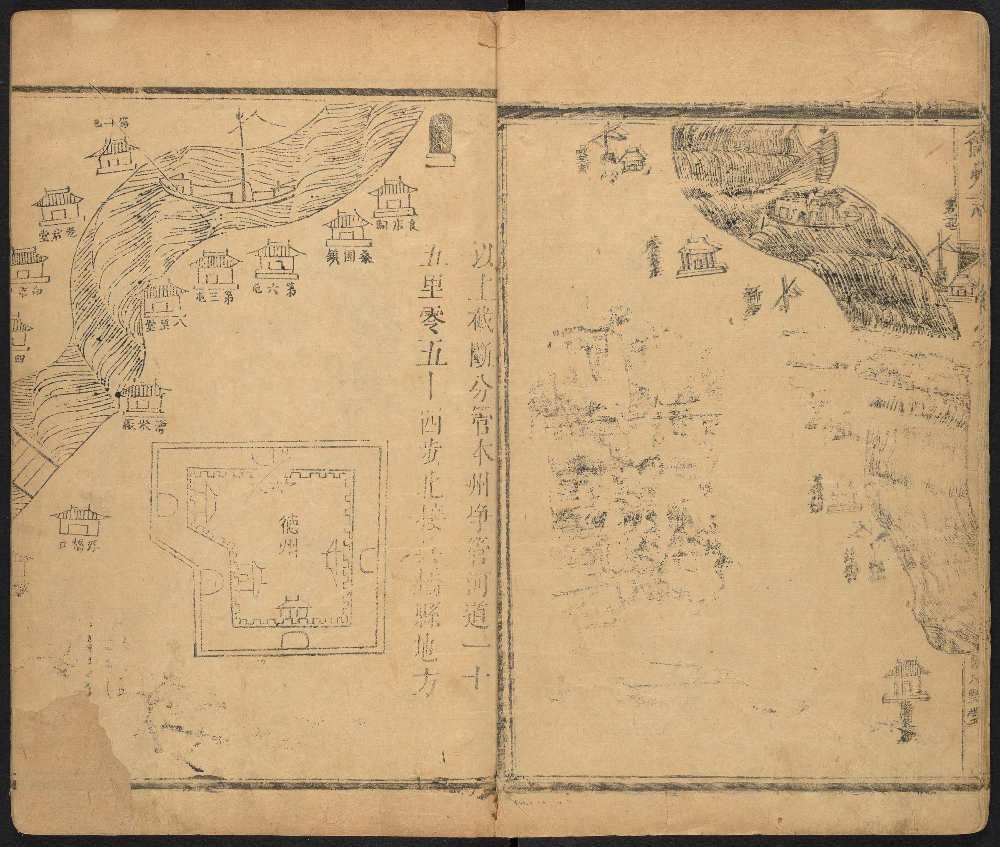

They would be typed as such:

```
<page seq="x"><ls>衛河道
小西門城角起至三皇廟南扇止 長一百二十九步係左位河道
[...]
杜家墳起至下八里堂止 長一里係德州河道</ls><pb />以上截斷分管本州爭管河道一十五里零五十四步北接吳橋地方□<char no="1" />馹 桑园 第□ 墩台 □□□ □□屯 第三屯 □□□ □□□ □□凹</img></page>
<page seq="y">第□屯 □□□ □□ □□□ 新□ □家□ □□□</img><pb />以上截斷分管本州爭管河道一十五里零丨西步北接□橋縣地方良店馹 桑園鎮 第六屯 德州 第三屯 八□堂 □米□ 第一屯 浮橋口 老君堂 白□ 四</img></page>
```

This complicated scenario has a few particular protocols of note:

- Always use the definitions provided in this document to determine regular texts (and paragraph changes), tables, lists, and images. If the definitions here do not provide conclusive evidence for where a string of texts should go, type them as regular texts and follow regular texts protocol accordingly. For example, in the second-half of the first sequence above, the string of texts that begins with `以上截斷` could be either a continuation of the list from the first-half or regular texts, and the third line of this string (`吳橋地方`) could be either a continuing part of this string, a part of this string but *with* a paragraph change, or the title of the image. Since there is no conclusive evidence, treat all three lines of the string as regular texts and type accordingly.
  - The same situation arises in the second-half of the second sequence above. Note that, because we treated that string of texts as regular texts, we must then define the second sequence as two separate images (one in the first-half and another in the second-half) and type them accordingly.
- Normally in lists, every line change (or vertical column change) is typed as a line break. Do not type a line break between the second and third vertical columns in the first-half of the first sequence above, however, because it is clear that they belong to the same list item and a line change only happened due to limited space. One can imagine that the same issue occurred before the first vertical column as well; however, since that line item spans two sequences, one must separate it into two parts.
- Images often have embedded texts that are in many different orientations. As long as all of those texts are typed properly, their order is not very important.
- There are some unreadable and unknown characters in the two sequences above. Please see the *Unreadable Characters* and *Unknown Characters* sections below for the complete mark-up protocol.

## Stamps

Ignore stamps and other images that are not part of the actual gazetteer contents (see also the marginalia protocol above). For example:

Image | Markup
----- | ------
 | `祖彭序`

# Miscellaneous Characters

## Unreadable Characters

If there is an unreadable character in the text, represent it with the symbol `□` ([U+25A1](https://www.fileformat.info/info/unicode/char/25a1/index.htm)). Type one `□` for each unreadable character. For example:

Image | Markup
----- | ------
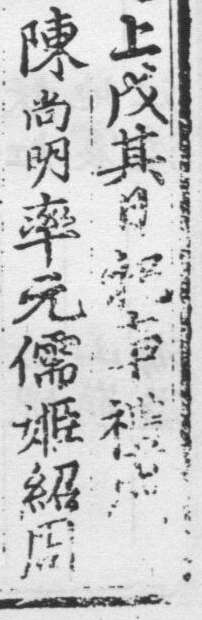 | `上戊其日□□禮□□陳尚明率元儒姬紹周`

## Unknown Characters

If there is an unknown character in the text, i.e. a character variant which is readable but where you cannot identify the standard character or cannot type it, add it to the numbered list of unknown characters. From then on, type its number inside the `<char>` tag whenever it occurs in the text, e.g. `<char no="1" />`.

Before you create a number for an unknown character, first check whether it is already on the list of unknown characters. Assign the number `1` to the first unknown character, `2` to the second unknown character, and so on. Do not assign the same number twice. Use this number to type the unknown character. Always use the same number if the same unknown character occurs again.

**Please note:** Make sure that for a given gazetteer title there is a single list containing images of all unknown characters and the corresponding numbers, and that everyone uses this list. When the text is sent back to us, we will need a copy of this list. For example:

Number | Character
------ | ---------
1 | 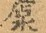
2 | 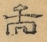

## Symbols

There are sometimes symbols (excluding punctuation marks) in the texts, e.g. circles. Treat these symbols as unknown characters and follow the same protocol above.
