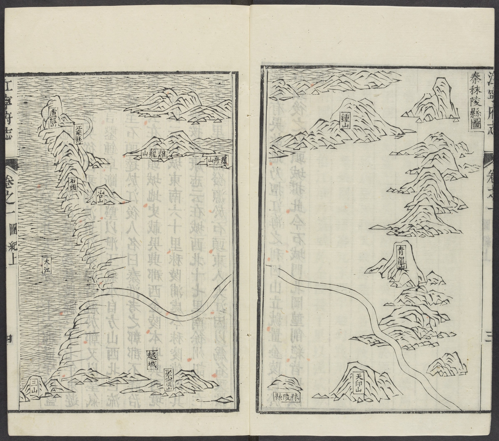

# File conventions

Save the text in plain text format (`.txt`) with Unicode `utf-8` encoding. Each Chinese local gazetteer title is saved in its own `.txt` file. Create a `.zip` archive of all files.

Make use of the complete character repertoire found in Unicode version 5.1. This includes characters in the following Unicode blocks when applicable:

* CJK Unified Ideographs Extension A (U+3400 -- U+4DFF)
* CJK Unified Ideographs Extension B (U+20000 -- U+2A6DF)

At this point, do not make use of the characters in Extension C or D.

We will also need the list of unknown characters and symbols. Please send the list in two versions, both in the original file format (e.g. RTF, DOC, XLS) and as PDF.

Every file should begin with `<book>` and end with `</book>`. All transcription and other tags should be placed between the `<book>` tags.

The file structure should look as follows:
```
<book>
  <meta>
  ...
  </meta>
  <content>
  ...
  </content>
</book>
```

## Metadata

Each gazetteer file corresponds to a catalog record from the Harvard-Yenching Library's [Chinese Rare Local Gazetteers collection](https://hollis.harvard.edu/primo-explore/search?query=any,contains,Harvard-Yenching%20Library%20Chinese%20Local%20Gazetteers%20Project%22&tab=everything&search_scope=everything&vid=HVD2&lang=en_US&offset=0&fromRedirectFilter=true). Type metadata information in the file between the `<meta>` and `</meta>` tags, using fields provided in catalog records.

For example:
```
<meta>
  <title>TITLE</title>
  <attribution>ATTRIBUTION</attribution>
  <author>AUTHOR</author>
  <published>PUBLISHED DATE</published>
  <description>DESCRIPTION</description>
  <notes>NOTES</notes>
  <subjects>SUBJECTS</subjects>
  <created>CREATION DATE</created>
  <hollis>HOLLIS NUMBER</hollis>
  <url>PERMALINK</url>
  <source>SOURCE</source>
</meta>
```

# Contents

Type all contents of each gazetteer between the `<content>` and `</content>` tags. Always start typing from the table of contents.

Begin every page with `<page>` and end with `</page>`. Type the page's entire content in one line between the two brackets `<page>` and `</page>`. Ignore line breaks in the text. *However*, if there are any spaces in the text other than line breaks, type one single space to represent them regardless of the length of space(s).

If there are blank pages in between texts, rather than at the very beginning (i.e. before the table of contents) or the very end of each gazetteer, still type the `<page>` and `</page>` tags but nothing in between them to indicate a blank page.

**Note:** In the digitization of the gazetteers, two pages may be on the same scan or on two consecutive scans.

For example:
```
<content>
  <page>TEXTS</page>
  <page></page>
  <page>TEXTS</page>
</content>
```

## Fontsize

Sometimes there are changes in fontsize, e.g. subscripts, or small-fonts arranged in parallel in one line. Simply disregard these fontsize changes and continue typing the texts *in the order of text flows*.

# Tables and Lists

Continue typing in one single line per page and use a single space as field separators between the .

**Note:** If you can identify a single space within a name etc. as a decorative space to make the table layout optically more pleasing, do not type it.

# Images

Use the `` tag to mark any images without any caption/title or texts embedded within it.

* If there is a caption/title available, include it inside the tag, i.e. ``.
* If the image has texts embedded within, type the texts in between the `` tags, i.e. `TEXTS</img>`.
* If the image has both a caption and texts embedded within, combine the two protocols above, i.e. `TEXTS</img>`.

For example:

Image | Markup
----- | ------
 | `<page></page>`<br />**Note:** Do not type any repetitive marginalia, e.g. book title and page numbers.
 | `<page>">東 訓導 儒學 教諭宅 東廡 名宦祠</img></page>`<br />**Note:** This image caption contains an unknown (i.e. untypable) character and the code makes use of the corresponding protocol (see below).
 | `<page>栗 鹿脯 鹽 棗 燭 [continue typing all texts]</img></page>`<br />**Note:** This is a list-figure with a title, so combine the list and image protocols.
 | `<page>建興郡 句容縣 [continue typing all texts]</img></page>`<br />`<page>親康宮 @@ [continue typing all texts]</img></page>`<br />**Note:** Although this map spans two pages, its caption (in its entirety) appears only on the first page. Thus, treat the first page as an image with both caption and texts embedded within, and the second page as an image with only texts embedded within. Also, the second page contains unreadable characters and the code makes use of the corresponding protocol (see below).

## Stamps

Ignore stamps and other images that are not part of the actual gazetteer contents.

# Miscellaneous Characters

## Unreadable Characters

If there is a unreadable character in the text, type the symbol `@` as substitute. Use one `@` for each unreadable character, e.g. `UNR@@DABLE`.

## Unknown Characters

If there is an unknown character in the text, i.e. a character variant which is readable but where you cannot identify the standard character or cannot type it, add it to the numbered list of unknown characters. From then on, type its number whenever it occurs in the text, e.g. `<001>`.

Before you create a number for an unknown character, first check whether it is already on the list of unknown characters. Assign the number `<001>` to the first unknown character, `<002>` to the second unknown character, and so on. Do not assign the same number twice. Use this number to type the unknown character. Always use the same number if the same unknown character occurs again.

**Please note:** Make sure that for a given gazetteer title there is a single list containing all unknown characters, and that everyone uses this list. When the text is sent back to us, we will need a copy of this list.

## Symbols

There are sometimes symbols (excluding punctuation marks) in the texts, e.g. circles. Treat these symbols as unknown characters and follow the same protocol above.
