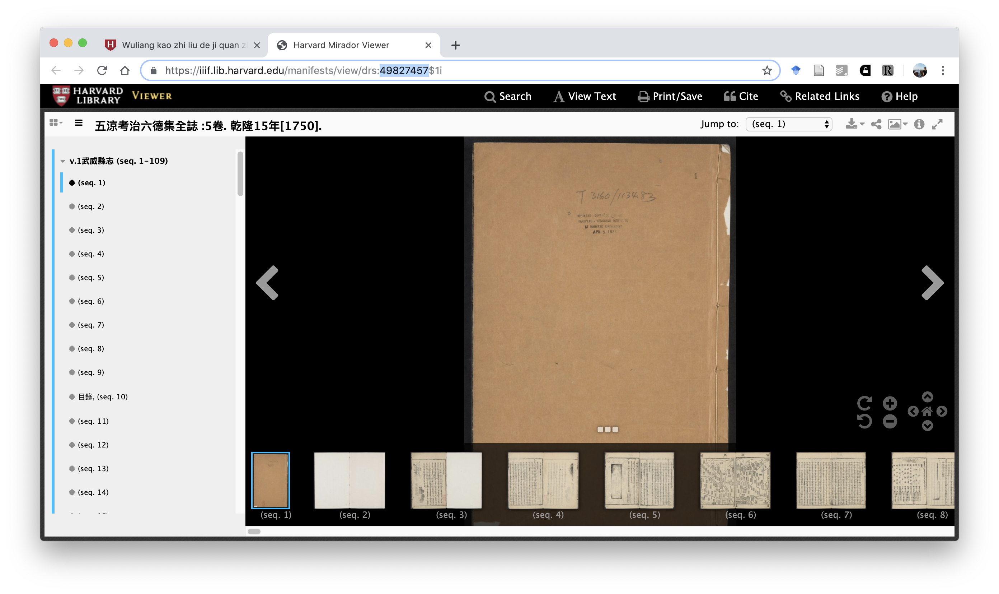

# Preamble

Since 2018, several hundred titles of local gazetteers from the Harvard-Yenching Library have been typed, currently totaling 707 files. In this round, we plan to add table-of-contents and related metadata to the files, in order to enrich its utility to our scholars. We will provide a spreadsheet of all the files to be amended in this round.

Each file already contains the following structure:
```
<book>
  <meta>
    <hollis>HOLLIS NUMBER</hollis>
    <title>TITLE</title>
  </meta>
  <content>
  </content>
</book>
```

We now add the following two fields of metadata, `<drs>` and `<toc>`, so that the structure will now look as follows:
```
<book>
  <meta>
    <hollis>HOLLIS NUMBER</hollis>
    <title>TITLE</title>
    <drs>DRS NUMBER</drs>
    <toc>
      TABLE OF CONTENTS INFORMATION
    </toc>
  </meta>
  <content>
  </content>
</book>
```

# DRS Number

Based on the URL of the image viewer, please enter the DRS number in the metadata. For example, the file `07453713.txt` links to the catalog record [五涼考治六德集全誌](http://id.lib.harvard.edu/alma/990074537130203941/catalog). After clicking on 'View Online,' the image viewer will open. From the URL, please copy the DRS number and enter it as `<drs>49827457</drs>`.



# Table of contents

We want to capture the table of contents (目錄) information from the image viewer, including starting and ending sequence numbers for each section.
