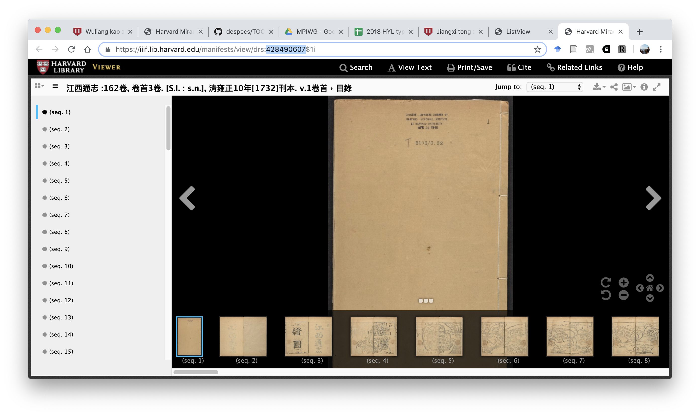
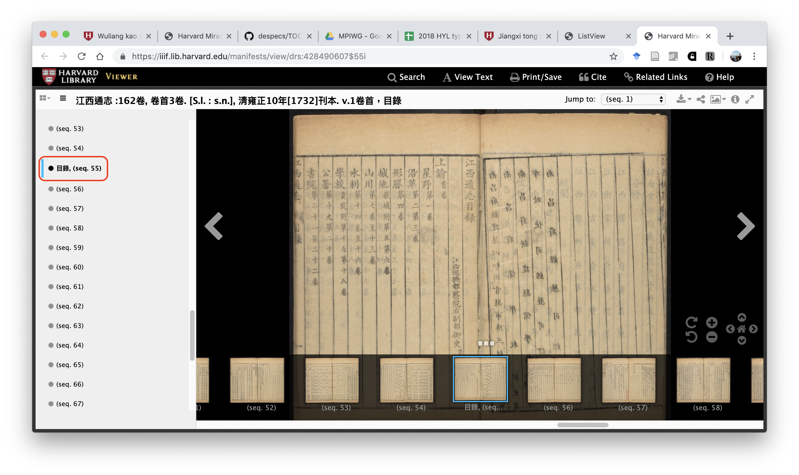
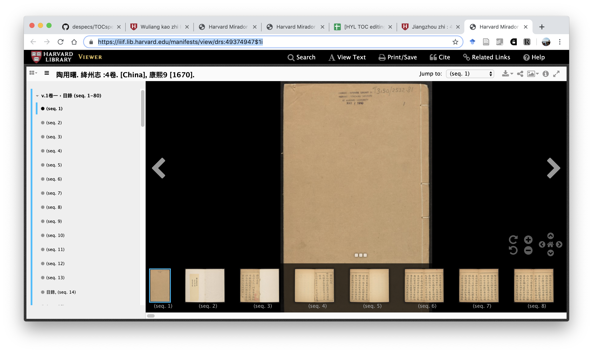
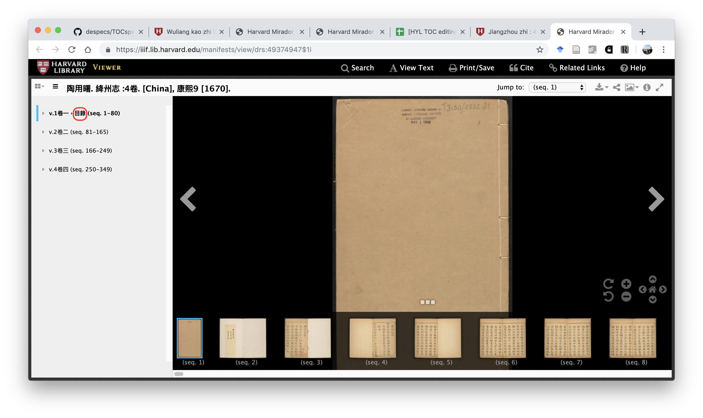
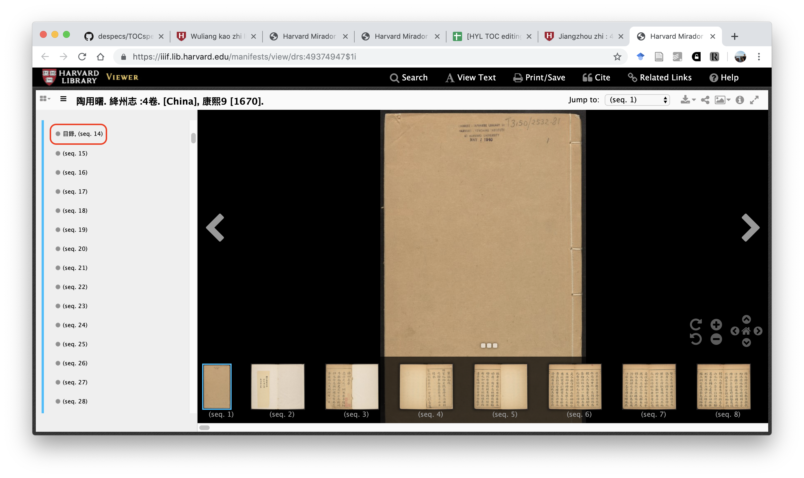
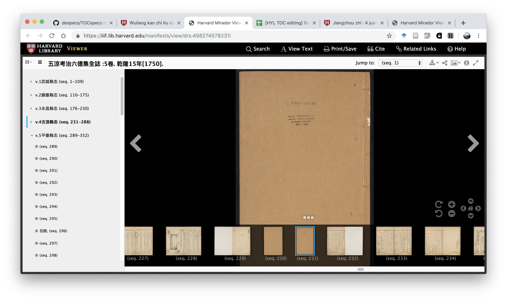

# Preamble

Since 2018, several hundred titles of local gazetteers from the Harvard-Yenching Library have been typed, currently totaling 707 files. In this round, we plan to add table-of-contents and related metadata to the files, in order to enrich its utility to our scholars. We will provide a spreadsheet listing all the files to be amended in this round.

Each file already contains the following structure:
```
<book>
  <meta>
    <hollis>HOLLIS NUMBER</hollis>
    <title>TITLE</title>
  </meta>
  <content>
  </content>
</book>
```

We now add the following two fields of metadata, `<url>` and `<toc>`, so that the structure will now look as follows:
```
<book>
  <meta>
    <hollis>HOLLIS NUMBER</hollis>
    <title>TITLE</title>
    <url>IMAGE VIEWER URL</url>
    <toc>
      TABLE OF CONTENTS INFORMATION
    </toc>
  </meta>
  <content>
  </content>
</book>
```

# Image viewer URL

Please copy and paste the URL of the image viewer into the metadata. For example, from the spreadsheet the file `07453713.txt` links to the catalog record [五涼考治六德集全誌](http://id.lib.harvard.edu/alma/990074537130203941/catalog). After clicking on 'View Online,' the image viewer will open. Please enter the URL as `<url>https://iiif.lib.harvard.edu/manifests/view/drs:49827457$1i</url>`.


# Table of contents

We want to capture the table of contents (目錄) information from the image viewer, including starting and ending sequence numbers for each section. To do so, one must first determine which of the three possible scenarios each file falls under:

1. The file is only part of a local gazetteer title: *rare but easy to detect*
2. The file is the entirety of a local gazetteer title: *the most common scenario*
3. The file contains multiple local gazetteer titles: *more difficult to detect*

Below we provide examples on how to enter table of contents information for all three scenarios.

## Scenario 1

Files under this scenario are easy to detect because their names will be in the format `HOLLIS#-xxx.txt`, where the HOLLIS numbers will be the same. For example, the catalog record [江西通志](http://id.lib.harvard.edu/alma/990074684980203941/catalog) produced 80 separate files, from `07468498-01.txt` to `07468498-80.txt`, with each representing one image viewer from [this list](https://listview.lib.harvard.edu/lists/drs-50151964). In this scenario, the table of contents information from all 80 files should be entered only in the first file `07468498-01.txt`, but the specific DRS numbers are entered in every corresponding file.

In the first file, `07468498-01.txt`, one can immediately add `<drs>428490607</drs>` to the metadata, based on the image viewer.



Then, scroll down the navigation on the left-hand side to locate the sequence with 目錄, in this case seq. 55.



In the table of contents, four fields of metadata are necessary to be entered: the section level （top three levels only), the section name, the section's starting sequence number, and its ending sequence number; the four fields are separated by the separator `|`. As you can see below, the section name field can often be copied directly without too much re-typing.

From browsing the scanned pages, one can see that the table of contents begins after `<pb />` on seq. 55 and ends before `<pb />` on seq. 57, within multiple `<ls>`. Now instead of re-typing the table of contents, one can simply navigate to later in the file, copy the texts already typed from seq. 55-57, and paste them to the metadata section. Once the texts have been pasted, edit them into the following `<toc>` format below, where the first two metadata fields can be immediately filled in based on the structure of the table of contents.

```
<toc>
1 | 上諭 首卷
1 | 星野
2 | 第一卷
1 | 沿革
2 | 第二卷
2 | 第三卷
1 | 形勝
2 | 第四卷
1 | 城池 疆域附
2 | 第五
2 | 第六卷
1 | 山川
2 | 第七卷
2 | 第八卷
2 | 第九卷
2 | 第十卷
2 | 第十一卷
2 | 第十二卷
2 | 第十三卷
1 | 水利
2 | 第十四卷
2 | 第十五卷
2 | 第十六卷
1 | 學校 貢院附
2 | 第十七卷
2 | 第十八卷
1 | 公署
2 | 第十九卷
2 | 第二十卷
[...]
1 | 藝文
2 | 詔敕表箋
3 | 第一百十四卷
2 | 劄子奏疏
3 | 第一百十五卷
[...]
3 | 一百十八卷
2 | 狀議
3 | 第一百十九卷
2 | 碑碣墓表
3 | 第一百二十
3 | 第一百二十一卷
2 | 記
3 | 第一百二十二卷
[...]
3 | 一百三十五卷
2 | 序
3 | 第一百三十六卷
[...]
3 | 一百三十九卷
2 | 書啟
3 | 第一百四十卷
2 | 論辨說考疏引
3 | 第一百四十一卷
2 | 傳贊頌銘
3 | 第一百四十二卷
2 | 題跋志書記畧
3 | 第一百四十三卷
2 | 文青詞
3 | 第一百四十四卷
2 | 教策講義語録文牒牌檄告約
3 | 第一百四十五卷
2 | 辭賦
3 | 第一百四十六卷
2 | 詩
3 | 第一百四十七卷
[...]
3 | 一百五十八卷 詩餘附末
1 | 雜記
2 | 第一百五十九卷
[...]
2 | 第一百六十二卷
```

Once this is done, then one must go through the files and locate the start and end sequence numbers of each section. Since this table of content covers multiple files, please add the file prefix before the specific sequence numbers. A tip: it is much easier to search for section headings based on keywords (e.g., 江西通志卷第三); try only using the image viewer for copying the URLs or for verification when the typed texts are unclear.

```
1 | 上諭 | 01-57 | 02-91
2 | 首卷之一 | 01-57 | 01-62
2 | 首卷之二 | 01-63 | 01-77
2 | 首卷之三 | 02-2 | 02-91
1 | 星野 | 03-2 | 03-26
2 | 第一卷 | 03-2 | 03-26
1 | 沿革 | 03-27 | 03-77
2 | 第二卷 | 03-27 | 03-53
2 | 第三卷 | 03-54 | 03-77
1 | 形勝 | 04-2 | 04-29
2 | 第四卷 | 04-2 | 04-29
1 | 城池 疆域附 | 04-29 | 05-42
2 | 第五卷 | 04-29 | 04-68
2 | 第六卷 | 05-2 | 05-42
1 | 山川 | 05-42 | 07-80
2 | 第七卷 | 05-42 | 05-66
2 | 第八卷 | 05-67 | 05-99
2 | 第九卷 | 06-2 | 06-37
2 | 第十卷 | 06-38 | 06-72
2 | 第十一卷 | 06-73 | 06-110
2 | 第十二卷 | 07-2 | 07-36
2 | 第十三卷 | 07-36 | 07-80
1 | 水利 | 08-2 | 09-37
2 | 第十四卷 | 08-2 | 08-33
2 | 第十五卷 | 08-33 | 08-74
2 | 第十六卷 | 09-2 | 09-37
1 | 學校 貢院附 | 09-38 | 10-46
2 | 第十七卷 | 09-38 | 09-77
2 | 第十八卷 | 10-2 | 10-46
1 | 公署 | 10-46 | 11-44
2 | 第十九卷 | 10-46 | 10-95
2 | 第二十卷 | 11-2 | 11-44
[...]
1 | 藝文 | 55-81 | 78-66
2 | 詔敕表箋 | 55-81 | 55-104
3 | 第一百十四卷 | 55-81 | 55-104
2 | 劄子奏疏 | 56-2 | 57-81
3 | 第一百十五卷 | 56-2 | 56-33
[...]
3 | 第一百十八卷 | 57-44 | 57-81
[...]
2 | 詩 | 73-2 | 78-66
3 | 第一百四十七卷 | 73-2 | 73-28
[...]
3 | 第一百五十八卷 詩餘附末 | 78-38 | 78-66
1 | 雜記 | 79-2 | 80-77
2 | 第一百五十九卷 | 79-2 | 79-48
[...]
2 | 第一百六十二卷 | 80-39 | 80-77
```

Putting this all together, the metadata section for the first file (`07468498-01.txt`) in this collection would look like the following:

```
<meta>
  <hollis>07468498-01</hollis>
  <title>［雍正］江西通志162卷首3卷</title>
  <url>https://iiif.lib.harvard.edu/manifests/view/drs:428490607$1i</url>
  <toc>
    1 | 上諭 | 01-57 | 02-91
    [...]
    2 | 第一百六十二卷 | 80-39 | 80-77
  </toc>
</meta>
```

And because the entire table of contents information is included with the first file, subsequent files from the second one onward will not have `<toc>` in the metadata, just the file's specific image viewer `<url>`. For example, the metadata section for the file `07468498-02.txt` would look like the following:

```
<meta>
  <hollis>07468498-02</hollis>
  <title>［雍正］江西通志162卷首3卷</title>
  <url>https://iiif.lib.harvard.edu/manifests/view/drs:54470198$1i</url>
</meta>
```

## Scenario 2

Files named as `HOLLIS#.txt` could be in either Scenarios 2 or 3 (though most of them will be in Scenario 2). Therefore for those files, the first thing to do, after `<url>` has been entered, is to collapse and expand all the navigational sections on the left-hand side of the image viewer and see how many times 目錄 appears. If 目錄 only appears only once, then this file falls under Scenario 2; if 目錄 appears more than once, then this file falls under Scenario 3.

Let's take `07486999.txt` (絳州志) as an example. From its [catalog record](http://id.lib.harvard.edu/alma/990074869990203941/catalog), we can link to its corresponding [image viewer](https://iiif.lib.harvard.edu/manifests/view/drs:49374947$1i) and copy the URL into the file's metadata in `<url>`. One can see below that the image viewer always opens to sequence 1 and has the first navigational section expanded on the left.



First collapse the first navigational section to see the entire list. Usually the navigational section titles will have 目錄 indicated already. But to be sure, now expand every navigational section one by one to see how many sequence(s) have 目錄 indicated. If there is only one, then you can be sure that this file falls under Scenario 2.



After expanding all navigational sections, we can confirm that this file only has one 目錄 on sequence 14. Therefore, this file falls under Scenario 2.



Similar to Scenario 1, from the image viewer we can see that the table of contents information are on sequences 14 and 15. Therefore, navigate to those sequences in the file to copy and paste the entire table of contents texts already typed to the metadata section. Then, organize them into section headings (up to three section levels) as below:

```
1 | 卷一
2 | 地理
3 | 建置
3 | 星野
3 | 形勝
3 | 疆域
3 | 城池
3 | 坊郷
3 | 堡墩
3 | 山川
3 | 水利
3 | 氷窑
3 | 橋梁
3 | 古蹟
3 | 風俗
3 | 節序
2 | 廨宇
3 | 官治
3 | 學校
3 | 祭噐
3 | 公署
3 | 堂閣
3 | 壇壝
3 | 祠廟
3 | 寺觀
3 | 陵墓
3 | 舖舎
2 | 食貨
3 | 戶口
3 | 田賦
3 | 課程
3 | 物産
2 | 帝系
3 | 王侯
1 | 卷二
2 | 職官
3 | 官秩
3 | 官師
3 | 名宦
2 | 人物
3 | 鄉賢
3 | 科貢 㧞貢准貢例授考授附
3 | 例貢 特貢附
3 | 武弁
3 | 武科
3 | 掾官
3 | 薦辟
3 | 封䕃
1 | 卷三
3 | 孝義
3 | 流寓
3 | 隠逸
3 | 貞烈
3 | 祥異 僊釋附
2 | 藝文
3 | 風
3 | 謡
3 | 賦
3 | 詩 雜體附
3 | 序
1 | 卷四
3 | 記 碑附
3 | 䟽
3 | 議
3 | 說
3 | 引
3 | 志
3 | 傳
3 | 墓志銘
3 | 墓表
3 | 法書
3 | 藏書
3 | 篇目
3 | 廣彚 附異附餘附續
```

As before, one must determine the appropriate section levels based on the scanned pages on the image viewer and the overall structure of the specific local gazetteer title.

Then, one can begin entering the starting and ending sequence numbers of each section heading.

## Scenario 3

Scenario 3 is when one single image viewer has multiple 目錄. It indicates that the corresponding file contains more than one local gazetteer title. For these files, the process of entering table of contents information is largely the same as Scenario 2, except that we use the notation `<toc index="x">` to note the multiple tables of contents.

Let's use the file `07453713.txt` as example. After consulting the navigational section on the left-hand side of the image viewer, one can see that this file actually contains five different titles of local gazetteers, with five different 目錄 indicated on sequences 10, 114, 181, 236, and 296.


